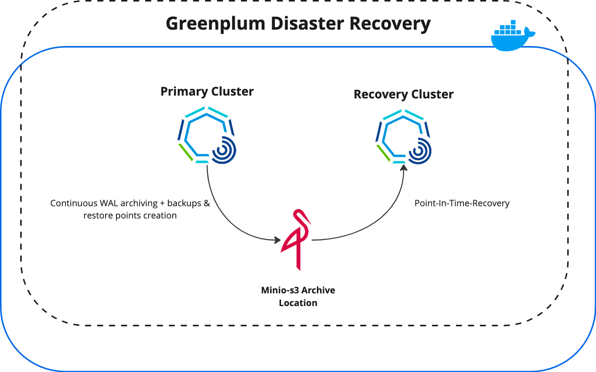

# Greenplum Cluster Recovery - Docker Environment 

### **About** : 
[Greenplum Cluster Recovery](https://docs.vmware.com/en/VMware-Greenplum-Cluster-Recovery/index.html) provides disaster recovery capabilities for Greenplum Database based on WAL archiving. It allows you to perform full and incremental backups of a database cluster’s files, as well as do point-in-time-recovery (PITR) from backups.

This Docker project, contains a GP primary cluster, recovery cluster and Minio as archive location, under a single docker network, as below:



### **HOW TO USE** :
1. Move to this folder and start docker containers:
    ```bash
    docker compose up -d
    ```
2. Open a new terminal and access the Primary-Cluster container:
    ```bash 
    docker compose exec -ti gpdb-primary-cluster bash
    ### You're now inside Primary Cluster container, run script that installs and configures GPCR utility:
    sh /home/gpadmin/script.sh
    ### Once finished (takes almost 5mn), you can now switch to gpadmin user
    su - gpadmin
    ### Check that your primary cluster is still up ! 
     psql demo
    ```

3. Open another terminal for DR cluster, access to DR-cluster container:
      ```bash
        docker compose exec -ti gpdb-disaster-recovery-cluster bash
        ### You're inside DR cluster, run:
        sh /home/gpadmin/script.sh
        ### Once finished (takes almost 5mn), Switch now to gpadmin user:
        su - gpadmin
        ### Pick the restore-point id by running:
        gpcr info
        ### Restore your GPDB (**** refers to restore-point id that you get from "gpcr info")
        gpcr restore --restore-point **** 
        ### Start the DR cluster
        gpstart -qa 
        ### Connect to it
        psql demo
      ```
